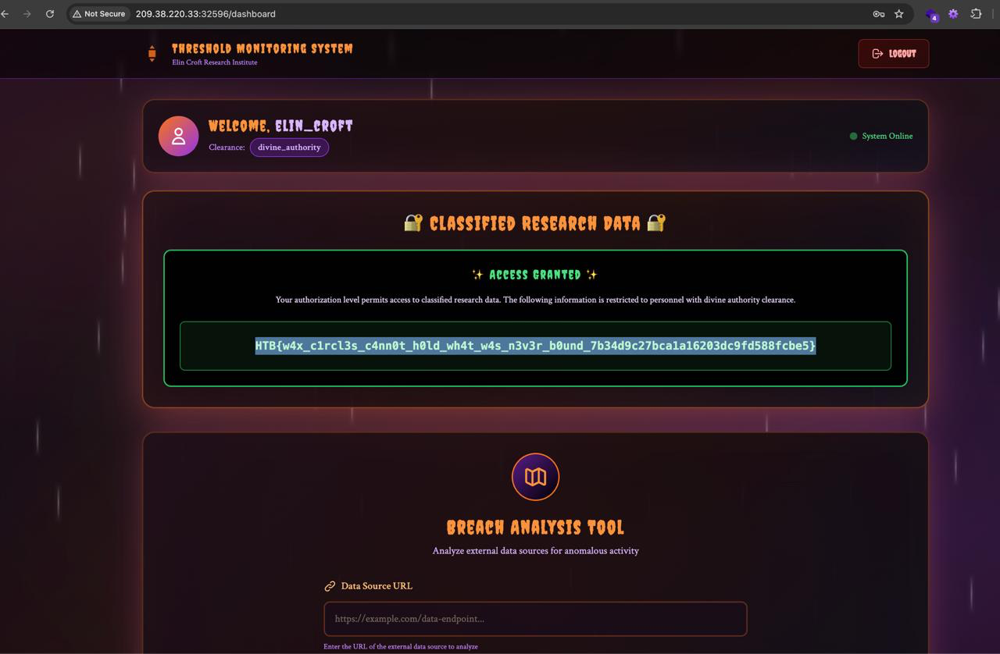

# The Wax-Circle Reclaimed

**Challenge Name:** The Wax-Circle Reclaimed  
**Category:** Web Security  
**Difficulty:** Medium-Hard  
**Points:** TBD

## Challenge Description

> Atop the standing stones of Black Fen, Elin lights her last tallow lantern. The mists recoil, revealing a network of unseen sigils carved beneath the fen's grass—her sister's old routes, long hidden. But the lantern flickers, showing Elin a breach line moving toward the heartstone. Her final task is not to seal a door, but to rewrite the threshold. Drawing from years of etched chalk and mirror-ink, she weaves a new lattice of bindings across the stone. As the Hollow King approaches, she turns the boundary web inward—trapping him in a net of his own forgotten paths.

## Technical Summary

A threshold monitoring system with a breach analysis tool vulnerable to **Server-Side Request Forgery (SSRF)**. The application allows accessing internal CouchDB to retrieve credentials for a privileged user account.

## Initial Analysis


The application features:
- Threshold Monitoring System interface
- Breach Analysis Tool that accepts external URLs
- Internal CouchDB database accessible via SSRF
- Privileged user `elin_croft` with elevated access

## Vulnerability: Server-Side Request Forgery (SSRF)

The Breach Analysis Tool accepts a URL parameter without proper validation, allowing requests to internal services:

**Attack Vector:**
```
http://127.0.0.1:5984/users/user_elin_croft
```

By pointing the breach analysis tool to the internal CouchDB instance, we can:
1. Access internal database endpoints
2. Retrieve user information including credentials
3. Use extracted credentials to authenticate as privileged users

## Exploitation Steps

1. **Access the Breach Analysis Tool** in the Threshold Monitoring System

2. **Submit SSRF payload** to access internal CouchDB:
   - Target: `http://127.0.0.1:5984/users/user_elin_croft`
   - This returns the user document containing authentication information

3. **Extract credentials** for `elin_croft` from the CouchDB response

4. **Authenticate** as `elin_croft` with the extracted credentials

5. **Access dashboard** to retrieve the flag



The dashboard displays the flag when authenticated as `elin_croft` who has `divine_authority` clearance level.

## Impact

- **SSRF vulnerability** allows access to internal services
- **Information disclosure** through internal database access
- **Authentication bypass** via credential extraction
- **Privilege escalation** by compromising high-clearance accounts

## Remediation

1. **Whitelist allowed URLs** - Only permit requests to approved external domains
2. **Block internal IP ranges** - Reject localhost, 127.0.0.0/8, and private IP ranges
3. **URL validation** - Parse and validate URLs before making requests
4. **Network segmentation** - Isolate internal services from application servers

## Tools Used

- Web browser for interface interaction
- cURL or similar for crafting SSRF requests

## References

- [OWASP: Server-Side Request Forgery](https://owasp.org/www-community/attacks/Server_Side_Request_Forgery)
