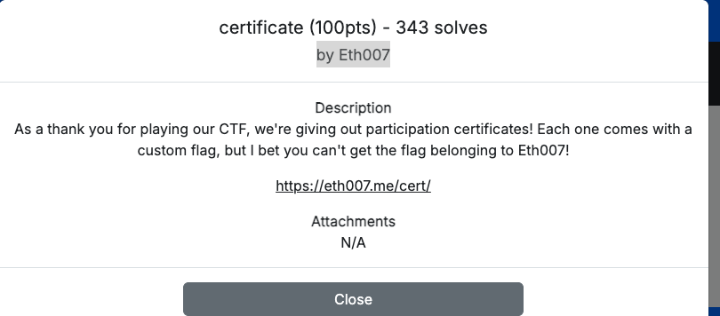
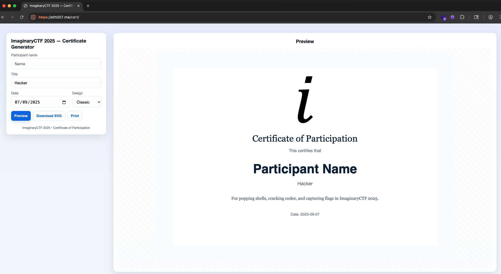
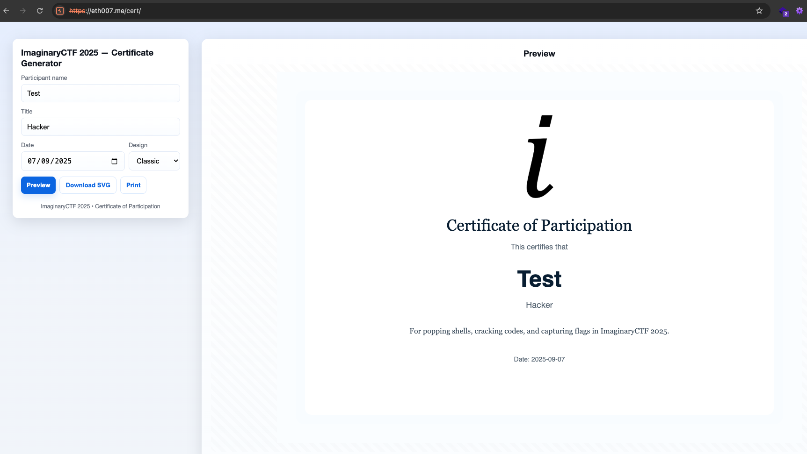
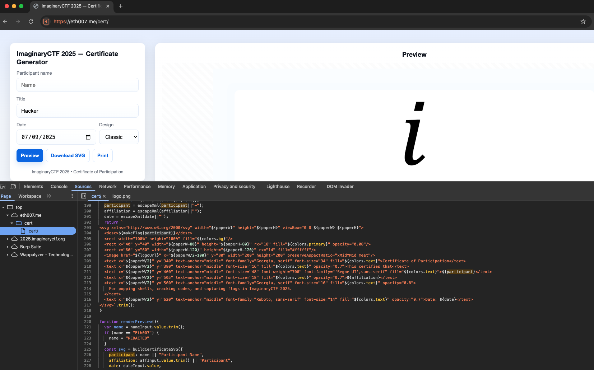
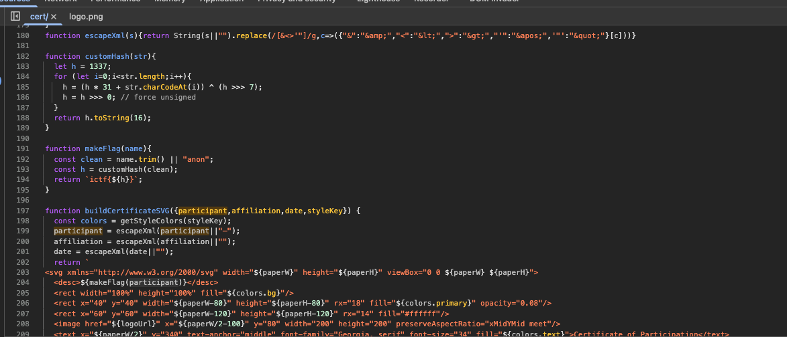
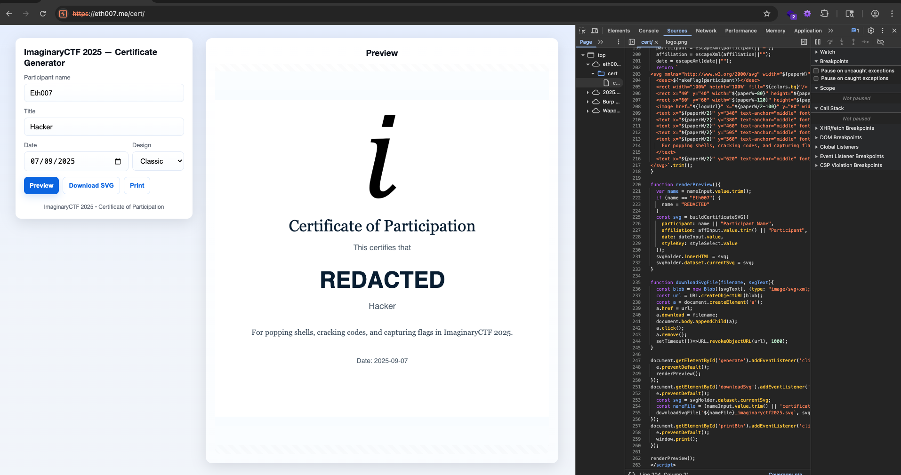
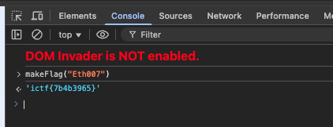

# Certificate (100pts) - by Eth007

## Description

No code is provided.



---

## First Look



Tried generating a test certificate and then previewing, downloading, and printing it.  
Observed that no API calls were made — this hints we need to dig deeper into the frontend code.



There is only **one main page** that has some logic, and nothing else.



Looking at the JavaScript, there is a `makeFlag` function that seems to generate a flag and then embed it inside the SVG. Weird.

---

## Code Analysis

```js
function makeFlag(name){
  const clean = name.trim() || "anon";
  const h = customHash(clean);
  return `ictf{${h}}`;
}

function buildCertificateSVG({participant,affiliation,date,styleKey}) {
  const colors = getStyleColors(styleKey);
  participant = escapeXml(participant||"—");
  affiliation = escapeXml(affiliation||"");
  date = escapeXml(date||"");
  return `
<svg xmlns="http://www.w3.org/2000/svg" width="${paperW}" height="${paperH}" viewBox="0 0 ${paperW} ${paperH}">
  <desc>${makeFlag(participant)}</desc>
  <rect width="100%" height="100%" fill="${colors.bg}"/>
  <rect x="40" y="40" width="${paperW-80}" height="${paperH-80}" rx="18" fill="${colors.primary}" opacity="0.08"/>
  <rect x="60" y="60" width="${paperW-120}" height="${paperH-120}" rx="14" fill="#ffffff"/>
  <image href="${logoUrl}" x="${paperW/2-100}" y="80" width="200" height="200" preserveAspectRatio="xMidYMid meet"/>
  <text x="${paperW/2}" y="340" text-anchor="middle" font-family="Georgia, serif" font-size="34" fill="${colors.text}">Certificate of Participation</text>
  <text x="${paperW/2}" y="380" text-anchor="middle" font-size="16" fill="${colors.text}" opacity="0.7">This certifies that</text>
  <text x="${paperW/2}" y="460" text-anchor="middle" font-size="48" font-weight="700" font-family="'Segoe UI',sans-serif" fill="${colors.text}">${participant}</text>
  <text x="${paperW/2}" y="505" text-anchor="middle" font-size="18" fill="${colors.text}" opacity="0.7">${affiliation}</text>
  <text x="${paperW/2}" y="560" text-anchor="middle" font-family="Georgia, serif" font-size="16" fill="${colors.text}" opacity="0.8">
    For popping shells, cracking codes, and capturing flags in ImaginaryCTF 2025.
  </text>
  <text x="${paperW/2}" y="620" text-anchor="middle" font-family="Roboto, sans-serif" font-size="14" fill="${colors.text}" opacity="0.7">Date: ${date}</text>
</svg>`.trim();
}

function renderPreview(){
  var name = nameInput.value.trim();
  if (name == "Eth007") {
    name = "REDACTED"
  } 
  const svg = buildCertificateSVG({
    participant: name || "Participant Name",
    affiliation: affInput.value.trim() || "Participant",
    date: dateInput.value,
    styleKey: styleSelect.value
  });
  svgHolder.innerHTML = svg;
  svgHolder.dataset.currentSvg = svg;
}
```

---

## Key Observation



The certificate name is **redacted for `Eth007`**, as enforced by the frontend JS.



But since the `makeFlag` function generates the flag, we can simply call it manually in the dev tools console with `Eth007`.

---

## Exploit



Calling `makeFlag("Eth007")` directly gives us the flag. ✅  

Weird but fun. Could dig deeper to understand more, but honestly, do we need to? 😅

---

