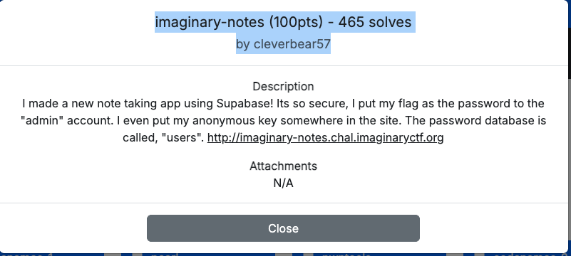
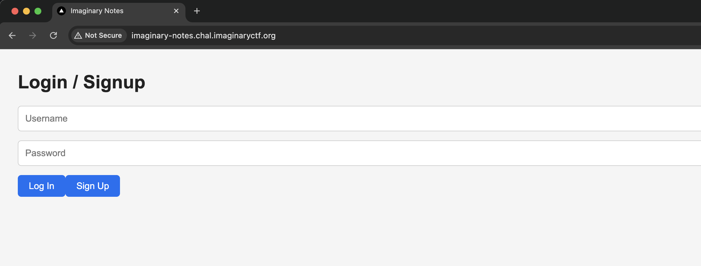
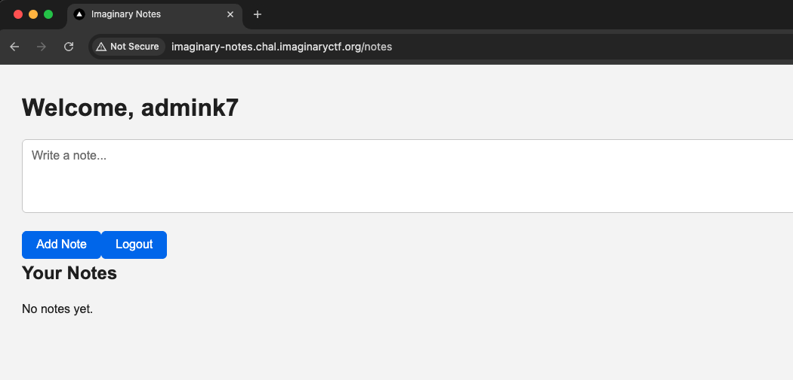
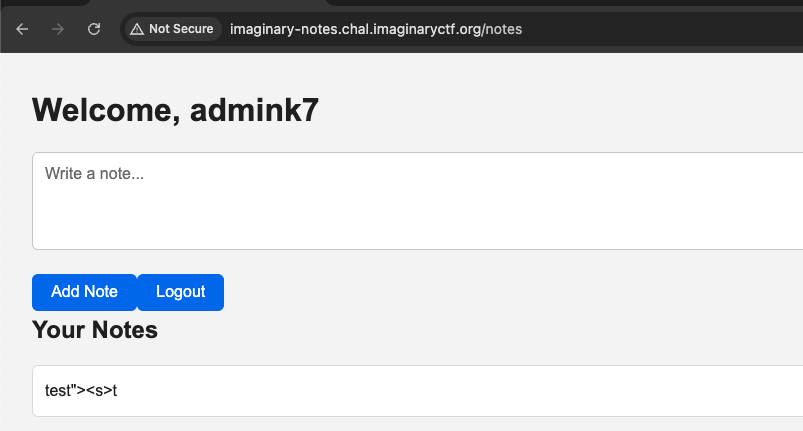
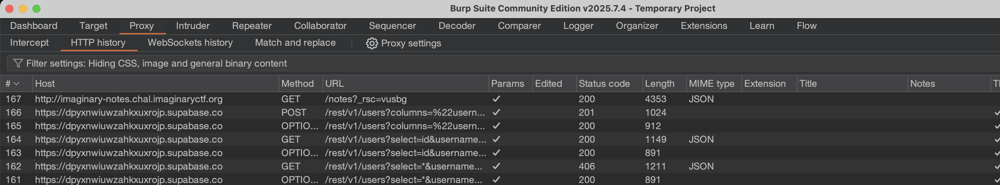
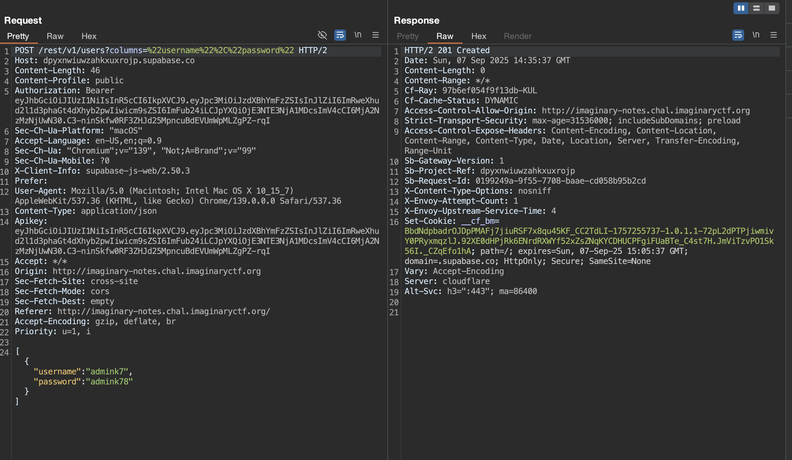
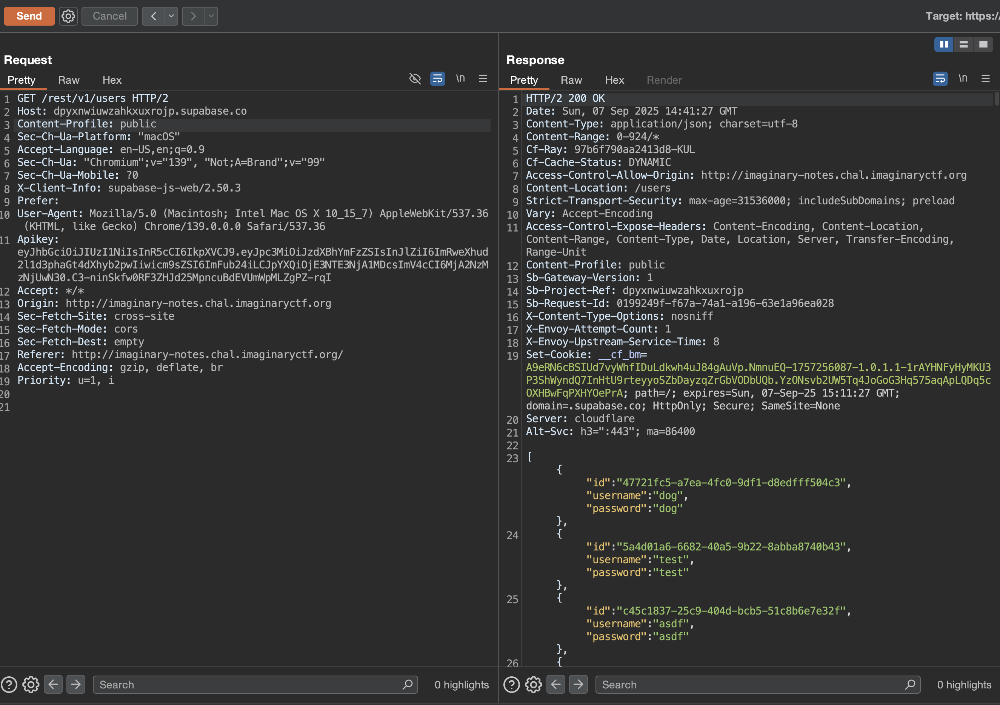
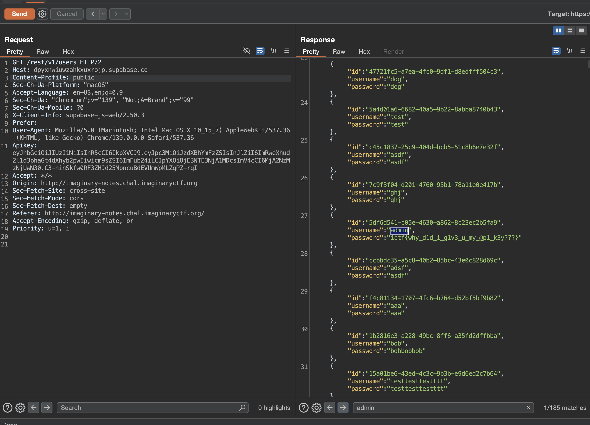

# Imaginary Notes (100pts) - by cleverbear57

## Description

No code is provided.  

From the description, it feels like the challenge will be using the Supabase JS SDK. But let’s see what unfolds.

---

## First Look

**After signing up:**  

**After adding a test note:**  

---

## Traffic Analysis

Let’s check the traffic in Burp:  

This confirms the usage of **Supabase**.  

Supabase REST API makes it very easy to perform DB operations. But an important part is getting the **RLS (Row-Level Security)** right.  
Anonymous keys need to be embedded in the frontend, since the REST API won’t work without them.

The Supabase API call shows that `users` is the database. Let’s see if we can interact with it.

And we can. Since everything is plain text, we have the flag as the **password for the admin user**. 🎯

---
